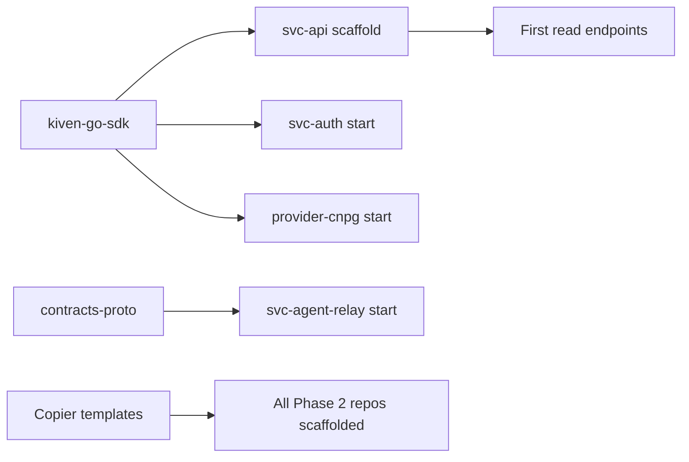
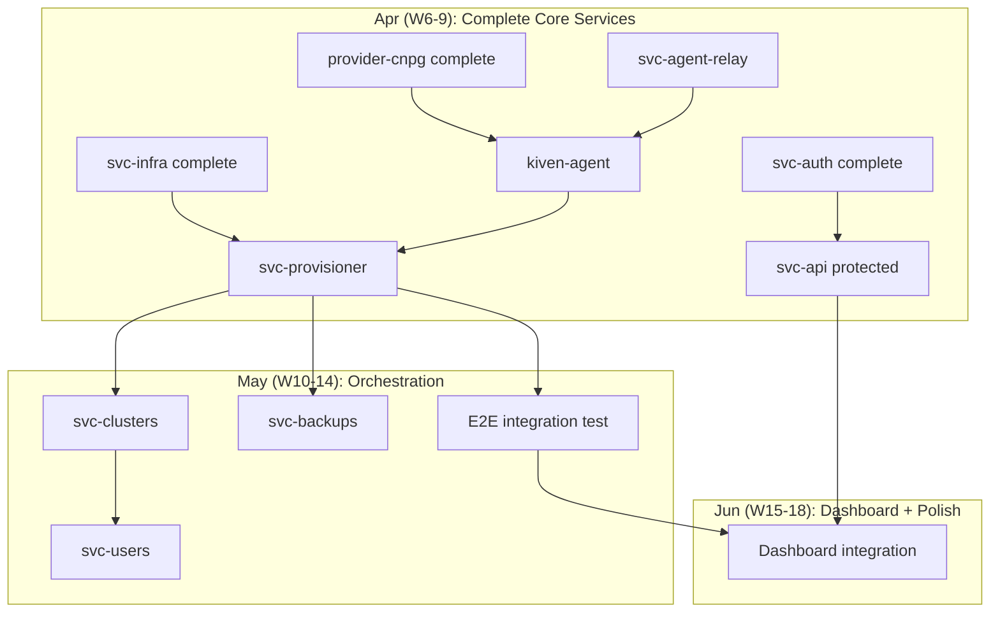
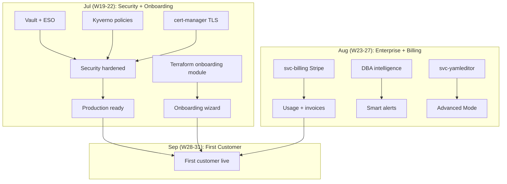
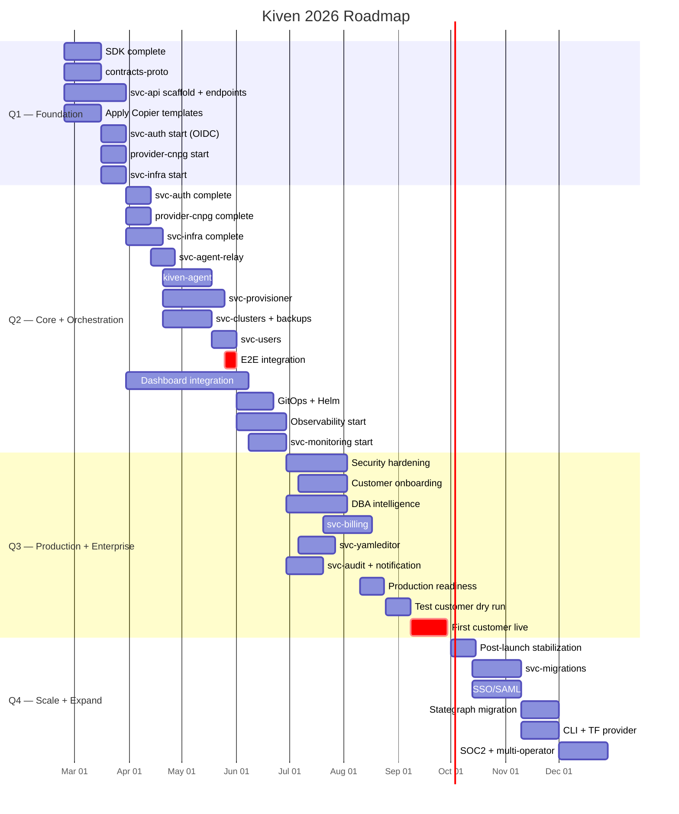

name: Kiven Team Roadmap
overview: Quarterly roadmap (Q1-Q4 2026) with weekly tracking. From foundation to production-ready managed PostgreSQL platform.
todos:
  - id: q1-sdk
    content: "Q1: Complete kiven-go-sdk (error types, middleware, OTel, DB helpers)"
    status: pending
  - id: q1-proto
    content: "Q1: Create contracts-proto (buf setup, agent.proto, metrics.proto)"
    status: pending
  - id: q1-api-scaffold
    content: "Q1: Scaffold svc-api (chi router, DB layer, first read endpoints)"
    status: pending
  - id: q1-templates
    content: "Q1: Apply Copier templates to all repos + create sdk-go template"
    status: pending
  - id: q1-auth-start
    content: "Q1: Start svc-auth (OIDC login)"
    status: pending
  - id: q2-auth
    content: "Q2: Complete svc-auth (API keys, RBAC)"
    status: pending
  - id: q2-cnpg
    content: "Q2: Build provider-cnpg (YAML generation, status parsing)"
    status: pending
  - id: q2-infra
    content: "Q2: Build svc-infra (AWS SDK, node groups, S3, IRSA)"
    status: pending
  - id: q2-agent
    content: "Q2: Build kiven-agent (CNPG informers, gRPC client, command executor)"
    status: pending
  - id: q2-provisioner
    content: "Q2: Build svc-provisioner (state machine, full pipeline)"
    status: pending
  - id: q2-e2e
    content: "Q2: End-to-end in kind (create DB → get connection string)"
    status: pending
  - id: q2-dashboard
    content: "Q2: Dashboard API integration + auth flow + real data"
    status: pending
  - id: q3-gitops
    content: "Q3: Production deployment (Flux, Helm, staging EKS)"
    status: pending
  - id: q3-observability
    content: "Q3: Observability stack (Prometheus, Loki, Tempo, Grafana)"
    status: pending
  - id: q3-security
    content: "Q3: Security hardening (Vault, mTLS, Kyverno, cert-manager)"
    status: pending
  - id: q3-onboarding
    content: "Q3: Customer onboarding (Terraform module, EKS discovery, wizard)"
    status: pending
  - id: q3-enterprise
    content: "Q3: Enterprise services (monitoring, billing, audit, notifications)"
    status: pending
  - id: q3-first-customer
    content: "Q3: First customer live on production"
    status: pending
  - id: q4-stategraph
    content: "Q4: Migrate Terraform state from S3 to Stategraph"
    status: pending
  - id: q4-migrations
    content: "Q4: svc-migrations (import from Aiven, RDS, bare PG)"
    status: pending
  - id: q4-soc2
    content: "Q4: SOC2 Type 1 evidence collection"
    status: pending
isProject: false
---

# Kiven Roadmap 2026 — Quarterly Plan with Weekly Tracking

## Current State (as of Feb 23, 2026)

| Asset | Status |
|-------|--------|
| `bootstrap` (Terraform SSO, Control Tower) | Done |
| `platform-github-management` (repo sync) | Done |
| `reusable-workflows` (8 workflows, 5 actions) | Done |
| `platform-templates-service-go` (Copier) | Done |
| `kiven-go-sdk` (15 files, 4 tests) | Partial |
| `dashboard` (14 pages) | Scaffolded, no API |
| `kiven-dev` (Taskfile, kind, CNPG) | Done |
| `svc-api` (OpenAPI spec) | Spec only, no Go code |
| All other services | Nothing |

**What does NOT work**: No service has Go code, no agent, no provider, no provisioning pipeline, no auth, no customer-facing functionality.

## Production Target

A customer can:

1. Sign up and log in (OIDC + SSO/SAML)
2. Register their EKS cluster (Terraform module)
3. Click "Create Database" → PostgreSQL connection string in ~10 minutes
4. See metrics, logs, backups, users, connection info in the dashboard
5. Get DBA recommendations, alerts, and performance insights
6. Power on/off databases on schedule
7. Pay via Stripe with usage tracking
8. Have full audit trail of all operations

## Team (4 developers)

| Role | Path |
|------|------|
| **Dev 1** — Backend Lead | SDK → svc-auth → svc-provisioner → svc-monitoring → svc-billing |
| **Dev 2** — K8s/Infra | contracts-proto → provider-cnpg → kiven-agent → observability → security |
| **Dev 3** — Cloud/AWS | svc-api → svc-infra → svc-clusters/backups/users → GitOps → onboarding |
| **Dev 4** — Frontend | Templates → dashboard → svc-yamleditor → svc-audit/notification |

## Calendar Reference

| Roadmap Week | Calendar Date | Quarter |
|---|---|---|
| W1 | Feb 23 | Q1 |
| W2 | Mar 2 | Q1 |
| W3 | Mar 9 | Q1 |
| W4 | Mar 16 | Q1 |
| W5 | Mar 23 | Q1 |
| W6 | Mar 30 | Q1→Q2 |
| W7 | Apr 6 | Q2 |
| W8 | Apr 13 | Q2 |
| W9 | Apr 20 | Q2 |
| W10 | Apr 27 | Q2 |
| W11 | May 4 | Q2 |
| W12 | May 11 | Q2 |
| W13 | May 18 | Q2 |
| W14 | May 25 | Q2 |
| W15 | Jun 1 | Q2 |
| W16 | Jun 8 | Q2 |
| W17 | Jun 15 | Q2 |
| W18 | Jun 22 | Q2 |
| W19 | Jun 29 | Q2→Q3 |
| W20 | Jul 6 | Q3 |
| W21 | Jul 13 | Q3 |
| W22 | Jul 20 | Q3 |
| W23 | Jul 27 | Q3 |
| W24 | Aug 3 | Q3 |
| W25-31 | Aug-Sep | Q3 |
| W32+ | Oct+ | Q4 |

---

# Q1 2026 — FOUNDATION (Feb 23 → Mar 31)

> **Theme**: Build the foundation. Every repo Phase 2 depends on is ready.
>
> **Objective**: SDK complete, gRPC contracts defined, svc-api serves data from DB, all repos scaffolded, dev environment works end-to-end.

## Q1 Dependency Graph



## Week 1 (Feb 23 - Feb 28)

| Dev | Repo | Task | Deliverable |
|-----|------|------|-------------|
| Dev 1 | `kiven-go-sdk` | Error types package (`errors/errors.go`), HTTP client helpers, pagination types | Shared error handling + HTTP primitives |
| Dev 1 | `kiven-go-sdk` | Refactor models to API contracts only (remove DB-specific fields, add docs) | Clean separation: SDK = API contracts |
| Dev 2 | `contracts-proto` | Define `.proto` files: `agent.proto`, `metrics.proto`, `commands.proto` | gRPC contract drafts |
| Dev 3 | `svc-api` | Scaffold Go project from Copier template (chi router, healthcheck, graceful shutdown, OTel init) | Running HTTP server at :8080/healthz |
| Dev 4 | All Phase 2 repos | Start running `copier copy` from template for: svc-auth, svc-infra, svc-agent-relay, provider-cnpg | First repos scaffolded |

**W1 Review checkpoint**: SDK has error types + pagination. svc-api starts. Proto files drafted.

## Week 2 (Mar 2 - Mar 6)

| Dev | Repo | Task | Deliverable |
|-----|------|------|-------------|
| Dev 1 | `kiven-go-sdk` | Middleware package (logging, recovery, request ID, auth context) | Reusable chi middleware for all svc-* |
| Dev 1 | `kiven-go-sdk` | OTel: MeterProvider (counters, histograms, gauges), pgx tracing hook | Metrics + auto-traced SQL queries |
| Dev 2 | `contracts-proto` | `buf.yaml`, `buf.gen.yaml`, CI with `buf lint` + `buf breaking` | Generated Go code in `gen/go/` |
| Dev 3 | `svc-api` | Database layer: pgx pool, migration runner, repository pattern, internal domain models | `ServiceRepository` + `internal/domain/service.go` |
| Dev 3 | `svc-api` | OpenAPI validation middleware (validate requests/responses against spec) | Every request validated against openapi.yaml |
| Dev 4 | All Phase 2 repos | Continue `copier copy` for: svc-clusters, svc-backups, svc-users, kiven-agent | All Phase 2 repos scaffolded |

**W2 Review checkpoint**: SDK has middleware + OTel metrics. Proto generates Go code. svc-api has DB layer.

## Week 3 (Mar 9 - Mar 13)

| Dev | Repo | Task | Deliverable |
|-----|------|------|-------------|
| Dev 1 | `kiven-go-sdk` | OTel: slog bridge (structured logs → OTel Logs), Kiven attribute constants (`kiven.org_id`, etc.) | Full traces + metrics + logs from day 1 |
| Dev 1 | `kiven-go-sdk` | Database helpers: pgx pool factory, migration runner, transaction helpers with OTel tracing | Every service connects to DB with 3 lines |
| Dev 2 | `contracts-proto` | Finalize agent protocol: Heartbeat (bidirectional), CommandStream (server-push), MetricsStream (agent-push) | Stable gRPC contract |
| Dev 3 | `svc-api` | Implement read-only endpoints: `GET /v1/plans`, `GET /v1/services`, `GET /v1/services/{id}` | First working API endpoints from DB |
| Dev 4 | `platform-templates-sdk-go` | Create Copier template for sdk-go (no Dockerfile, no cmd/, no gRPC) | Template ready for provider repos |
| Dev 4 | `kiven-dev` | Verify `task dev` works end-to-end: Docker Compose + kind + CNPG + svc-api starts | Working local dev environment |

**W3 Review checkpoint**: SDK feature-complete. Proto stable. svc-api returns plans from DB. `task dev` works.

### -- PHASE 1 COMPLETE --

**Exit criteria**:
- [ ] `task dev` starts infra + svc-api
- [ ] `svc-api` returns service plans from DB
- [ ] `contracts-proto` generates Go code via `buf generate`
- [ ] All Phase 2 repos scaffolded (editorconfig, golangci, pre-commit, CI, Taskfile, Dockerfile, go.mod)
- [ ] `kiven-go-sdk` has: errors, middleware, OTel (traces + metrics + logs), DB helpers

---

## Week 4 (Mar 16 - Mar 20)

| Dev | Repo | Task | Deliverable |
|-----|------|------|-------------|
| Dev 1 | `svc-auth` | OIDC integration (Google/GitHub login via `coreos/go-oidc`), JWT token issuance | Users can log in, get a JWT |
| Dev 2 | `provider-cnpg` | Implement `GenerateClusterYAML()` — given a service definition, produce valid CNPG Cluster manifest | CNPG Cluster YAML generation |
| Dev 3 | `svc-infra` | AWS SDK integration: `AssumeRole` into customer account, EKS `DescribeCluster` | Can access customer AWS resources |
| Dev 4 | `svc-api` | CRUD endpoints: `POST /v1/services`, `DELETE /v1/services/{id}`, `PATCH /v1/services/{id}` | Can create/update/delete services via API |

**W4 Review checkpoint**: OIDC login works. CNPG YAML generation started. AWS AssumeRole works.

## Week 5 (Mar 23 - Mar 27)

| Dev | Repo | Task | Deliverable |
|-----|------|------|-------------|
| Dev 1 | `svc-auth` | API key management (create, list, revoke, hash with argon2) | Programmatic access for CLI/Terraform |
| Dev 2 | `provider-cnpg` | `GeneratePoolerYAML()`, `GenerateScheduledBackupYAML()` | Full CNPG manifest generation |
| Dev 3 | `svc-infra` | Create EKS managed node group (dedicated, tainted, right instance type) | Can create DB nodes in customer cluster |
| Dev 4 | `svc-api` | Customer cluster endpoints: `POST /v1/clusters`, `GET /v1/clusters` | Can register customer EKS clusters |

**W5 Review checkpoint**: API keys work. Provider generates Cluster + Pooler + Backup YAML. Node group creation works.

## Q1 Exit Criteria

- [ ] SDK feature-complete (errors, middleware, OTel, DB helpers)
- [ ] gRPC contracts defined and generating Go code
- [ ] `svc-api` serves CRUD endpoints from PostgreSQL
- [ ] All Phase 2 repos scaffolded with Copier template
- [ ] `task dev` works end-to-end locally
- [ ] OIDC login flow works (svc-auth)
- [ ] CNPG YAML generation works (provider-cnpg)
- [ ] AWS AssumeRole + node group creation works (svc-infra)

## Q1 Evolution Tracker

| Week | SDK | Proto | svc-api | Templates | svc-auth | provider-cnpg | svc-infra |
|------|-----|-------|---------|-----------|----------|---------------|-----------|
| W1   | 🔨  | 🔨    | 🔨      | 🔨        | —        | —             | —         |
| W2   | 🔨  | 🔨    | 🔨      | 🔨        | —        | —             | —         |
| W3   | ✅  | ✅    | ✅      | ✅        | —        | —             | —         |
| W4   | —   | —     | 🔨      | —         | 🔨       | 🔨            | 🔨        |
| W5   | —   | —     | ✅      | —         | 🔨       | 🔨            | 🔨        |

Legend: — not started, 🔨 in progress, ✅ done

---

# Q2 2026 — CORE + ORCHESTRATION + DASHBOARD (Apr 1 → Jun 30)

> **Theme**: Build everything needed for the MVP. Auth, provider, agent, provisioner, dashboard.
>
> **Objective**: A user can log in, create a database from the dashboard, and get a working PostgreSQL connection string — all in a local kind cluster. Full provisioning pipeline works end-to-end.

## Q2 Dependency Graph



## Week 6 (Mar 30 - Apr 3)

| Dev | Repo | Task | Deliverable |
|-----|------|------|-------------|
| Dev 1 | `svc-auth` | RBAC middleware (admin, operator, viewer roles), org/team model | Role-based access control |
| Dev 1 | `svc-api` | Integrate auth middleware, protect all endpoints | Every API call requires valid token |
| Dev 2 | `provider-cnpg` | Implement `ParseStatus()`, `ParseMetrics()` from CNPG CRD status fields | Can read CNPG cluster state |
| Dev 3 | `svc-infra` | Create S3 bucket (encrypted, lifecycle rules) for backups, create IRSA role for CNPG | Backup infrastructure ready |
| Dev 4 | `dashboard` | API client layer: fetch wrapper, auth token management, error handling | Type-safe API client |

**W6 Review checkpoint**: Auth complete (OIDC + API keys + RBAC). Provider can parse status. S3 bucket creation works.

## Week 7 (Apr 6 - Apr 10)

| Dev | Repo | Task | Deliverable |
|-----|------|------|-------------|
| Dev 1 | `svc-auth` | Unit + integration tests for OIDC, API keys, RBAC | Auth fully tested |
| Dev 2 | `provider-cnpg` | Integration tests: generate YAML → validate against CNPG CRD schema | Provider fully tested |
| Dev 2 | `contracts-proto` | Finalize: Heartbeat, CommandStream, MetricsStream — stable contract | gRPC contract frozen |
| Dev 3 | `svc-infra` | Create EBS StorageClass (gp3, encrypted, right IOPS) | Storage ready for DB volumes |
| Dev 4 | `dashboard` | Auth flow: login page, OIDC redirect, token storage, protected routes | Users can log in via dashboard |

**W7 Review checkpoint**: Auth tested. Provider tested. svc-infra can create storage. Dashboard login works.

## Week 8 (Apr 13 - Apr 17)

| Dev | Repo | Task | Deliverable |
|-----|------|------|-------------|
| Dev 1 | `svc-provisioner` | Scaffold + state machine design: `provisioning_jobs` table, step definitions | Provisioner architecture ready |
| Dev 2 | `svc-agent-relay` | gRPC server: agent registration, heartbeat tracking, connection management | Agents can connect |
| Dev 3 | `svc-api` | Backup endpoints, user management endpoints, remaining CRUD | Full API endpoint coverage |
| Dev 4 | `dashboard` | Service list page: real data from API, create service wizard | Can create a database from the UI |

**W8 Review checkpoint**: Provisioner designed. Agent relay accepts connections. Full API CRUD. Dashboard shows services.

### -- CORE SERVICES COMPLETE --

**Exit criteria (Week 8)**:
- [ ] svc-auth: OIDC + API keys + RBAC, fully tested
- [ ] provider-cnpg: YAML generation + status parsing, fully tested
- [ ] svc-infra: AssumeRole + node groups + S3 + IRSA + StorageClass
- [ ] svc-agent-relay: gRPC server accepts agent connections
- [ ] svc-api: full CRUD for services, clusters, backups, users

---

## Week 9 (Apr 20 - Apr 24)

| Dev | Repo | Task | Deliverable |
|-----|------|------|-------------|
| Dev 1 | `svc-provisioner` | Steps implementation: create_nodes → create_storage → create_s3 (calls svc-infra) | First 3 provisioning steps work |
| Dev 2 | `kiven-agent` | Go binary: gRPC client to relay, CNPG informers (watch Cluster/Backup CRDs), heartbeat | Agent running in kind, reports CNPG |
| Dev 3 | `svc-clusters` | Cluster lifecycle: get status from agent, basic CRUD | Can see cluster status |
| Dev 4 | `dashboard` | Service detail page: real connection info, status from API, power on/off | Can see database status in UI |

**W9 Review checkpoint**: Provisioner creates infra resources. Agent watches CNPG CRDs. Cluster status visible.

## Week 10 (Apr 27 - May 1)

| Dev | Repo | Task | Deliverable |
|-----|------|------|-------------|
| Dev 1 | `svc-provisioner` | Steps: install_cnpg → deploy_cluster (calls agent-relay to send commands to agent) | Full pipeline: API → provisioner → infra + agent |
| Dev 2 | `kiven-agent` | Command executor: receive YAML from relay, `kubectl apply`, report result | Can apply CNPG manifests on command |
| Dev 3 | `svc-clusters` | Scale (change instances), power on/off (delete pods + scale node group) | Scale up/down, power on/off |
| Dev 4 | `dashboard` | Backups page (real data from API), backup timeline visualization | Backups visible in UI |

**W10 Review checkpoint**: Full provisioning pipeline works (API → provisioner → infra → agent → CNPG). Power on/off works.

## Week 11 (May 4 - May 8)

| Dev | Repo | Task | Deliverable |
|-----|------|------|-------------|
| Dev 1 | `svc-provisioner` | Error handling, retries, rollback on failure, idempotency | Resilient provisioning |
| Dev 2 | `kiven-agent` | PG stats collector: connect to PG, collect pg_stat_statements, send to relay | Metrics flowing to SaaS |
| Dev 3 | `svc-backups` | Backup management: trigger backup via agent, list backups from S3, restore | Backup/restore working |
| Dev 4 | `dashboard` | Users page (CRUD), metrics page (charts from agent data) | Full dashboard pages |

**W11 Review checkpoint**: Provisioner handles errors. PG metrics flowing. Backup/restore works. All dashboard pages exist.

## Week 12 (May 11 - May 15)

| Dev | Repo | Task | Deliverable |
|-----|------|------|-------------|
| Dev 1 | `svc-provisioner` | Integration tests: full pipeline in kind | Provisioner fully tested |
| Dev 2 | `kiven-agent` | Log aggregator: collect PG logs from all pods, send to relay | Logs flowing to SaaS |
| Dev 2 | `kiven-agent-helm` | Helm chart for agent deployment | One-command agent install |
| Dev 3 | `svc-backups` | PITR restore, fork/clone support | Advanced backup features |
| Dev 4 | `dashboard` | Loading states, error handling, empty states | UI polish |

**W12 Review checkpoint**: Provisioner tested. Agent has Helm chart. PITR works. Dashboard polished.

## Week 13 (May 18 - May 22)

| Dev | Repo | Task | Deliverable |
|-----|------|------|-------------|
| Dev 1 | `svc-provisioner` | Status reporting: webhook/polling to update service status in svc-api | Real-time provisioning status |
| Dev 2 | `kiven-agent` | Infrastructure reporter: node status, storage usage, resource availability | Infrastructure metrics in SaaS |
| Dev 3 | `kiven-go-sdk` | Create `models.DatabaseUser` (distinct from dashboard User) + migration | Domain model for PG users |
| Dev 3 | `svc-users` | PG user management via agent: CREATE ROLE, GRANT, password rotation | Can manage database users |
| Dev 4 | `dashboard` | Responsive design, dark mode, accessibility | Production-ready UI |

**W13 Review checkpoint**: Provisioning status updates in real-time. DB user management works. Dashboard responsive.

## Week 14 (May 25 - May 29)

| Dev | Repo | Task | Deliverable |
|-----|------|------|-------------|
| All | E2E | End-to-end test in kind: create service → provisioner → agent → CNPG → PG running → connection string | **MVP proof: full loop works** |
| Dev 1 | `svc-provisioner` | Performance optimization, concurrent provisioning | Can provision multiple DBs |
| Dev 4 | `dashboard` | E2E test from UI: login → create DB → see status → manage users/backups | Full UI E2E |

**W14 Review checkpoint**: **CRITICAL MILESTONE — Full loop works in kind.** User creates DB → gets connection string.

### -- ORCHESTRATION COMPLETE --

**Exit criteria (Week 14)**:
- [ ] In kind: user creates service via API → provisioner → agent → CNPG cluster → connection string
- [ ] Backup/restore + PITR works
- [ ] DB user management works
- [ ] Agent collects metrics + logs from PostgreSQL
- [ ] Dashboard shows everything

---

## Week 15 (Jun 1 - Jun 5)

| Dev | Repo | Task | Deliverable |
|-----|------|------|-------------|
| Dev 1 | `svc-provisioner` | Hardening: retry logic, circuit breakers, graceful degradation | Production-grade provisioner |
| Dev 2 | `platform-observability` | Install Prometheus + Grafana via Helm, ServiceMonitor for all services | Metrics collection started |
| Dev 3 | `platform-gitops` | Flux Kustomizations/HelmReleases for all svc-*, environments (dev, staging, prod) | GitOps deployment pipeline |
| Dev 4 | `dashboard` | Settings page, organization management, team invitations | Admin features |

**W15 Review checkpoint**: GitOps pipeline ready. Prometheus collecting metrics. Provisioner hardened.

## Week 16 (Jun 8 - Jun 12)

| Dev | Repo | Task | Deliverable |
|-----|------|------|-------------|
| Dev 1 | `svc-monitoring` | Scaffold + metrics ingestion from agent: pg_stat_statements, connections, replication lag | Metrics pipeline from agent to SaaS |
| Dev 2 | `platform-observability` | Install Loki + Promtail, configure log ingestion | Centralized logging |
| Dev 3 | All svc-* repos | Production Helm charts (per service), Kustomize overlays for env-specific config | `helm install svc-api` works |
| Dev 4 | `dashboard` | API documentation page (Redoc), connection string helper | Developer experience |

**W16 Review checkpoint**: Metrics pipeline ingesting. Loki collecting logs. Helm charts for all services.

## Week 17 (Jun 15 - Jun 19)

| Dev | Repo | Task | Deliverable |
|-----|------|------|-------------|
| Dev 1 | `svc-monitoring` | Basic alerting: connection pool exhaustion, replication lag, disk usage | Critical alerts work |
| Dev 2 | `platform-observability` | OTel Collector (DaemonSet agents + Gateway), Tempo as trace backend | Distributed tracing |
| Dev 3 | `kiven-dev` | Staging environment in real EKS: Terraform for Kiven SaaS EKS cluster | Staging cluster on AWS |
| Dev 4 | `svc-audit` | Scaffold + immutable audit log: every API call, every infra change, who/what/when | Audit trail started |

**W17 Review checkpoint**: Alerting works. Tracing live. Staging EKS cluster exists. Audit logging.

## Week 18 (Jun 22 - Jun 26)

| Dev | Repo | Task | Deliverable |
|-----|------|------|-------------|
| Dev 1 | `svc-monitoring` | Grafana dashboards: service health, request latency, error rates, agent status | Operations visibility |
| Dev 2 | `platform-observability` | SLO definitions (99.9% API, <200ms p95), error budget alerts (Sloth/Pyrra) | SLO monitoring |
| Dev 3 | `platform-gitops` | Promotion workflow: dev → staging → prod with approval gates | Controlled rollouts |
| Dev 4 | `svc-notification` | Alert dispatch: Slack, email, webhook integration | Multi-channel alerting |

**W18 Review checkpoint**: Grafana dashboards live. SLOs defined. Promotion workflow. Notifications dispatch.

## Q2 Exit Criteria

- [ ] svc-auth complete: OIDC + API keys + RBAC + tests
- [ ] provider-cnpg complete: YAML gen + status parsing + tests
- [ ] svc-infra complete: node groups + S3 + IRSA + StorageClass
- [ ] kiven-agent: CNPG informers + command executor + PG stats + logs
- [ ] svc-provisioner: full pipeline, tested, resilient
- [ ] svc-clusters + svc-backups + svc-users: all working
- [ ] **E2E in kind: login → create DB → get connection string → manage**
- [ ] Dashboard: all pages with real data, auth, responsive
- [ ] GitOps pipeline (Flux) deployed
- [ ] Observability started (Prometheus, Loki, Tempo, Grafana)
- [ ] Staging EKS cluster running
- [ ] svc-monitoring ingesting metrics + basic alerts
- [ ] svc-audit + svc-notification scaffolded

## Q2 Evolution Tracker

| Week | Auth | Provider | Infra | Relay | Agent | Provisioner | Clusters | Backups | Users | Dashboard | GitOps | Observ. |
|------|------|----------|-------|-------|-------|-------------|----------|---------|-------|-----------|--------|---------|
| W6   | ✅   | 🔨       | 🔨    | —     | —     | —           | —        | —       | —     | 🔨        | —      | —       |
| W7   | ✅   | ✅       | 🔨    | —     | —     | —           | —        | —       | —     | 🔨        | —      | —       |
| W8   | ✅   | ✅       | ✅    | 🔨    | —     | 🔨          | —        | —       | —     | 🔨        | —      | —       |
| W9   | ✅   | ✅       | ✅    | ✅    | 🔨    | 🔨          | 🔨       | —       | —     | 🔨        | —      | —       |
| W10  | ✅   | ✅       | ✅    | ✅    | 🔨    | 🔨          | 🔨       | —       | —     | 🔨        | —      | —       |
| W11  | ✅   | ✅       | ✅    | ✅    | 🔨    | 🔨          | ✅       | 🔨      | —     | 🔨        | —      | —       |
| W12  | ✅   | ✅       | ✅    | ✅    | ✅    | 🔨          | ✅       | 🔨      | —     | 🔨        | —      | —       |
| W13  | ✅   | ✅       | ✅    | ✅    | ✅    | ✅          | ✅       | ✅      | 🔨    | 🔨        | —      | —       |
| W14  | ✅   | ✅       | ✅    | ✅    | ✅    | ✅          | ✅       | ✅      | ✅    | ✅        | —      | —       |
| W15  | ✅   | ✅       | ✅    | ✅    | ✅    | ✅          | ✅       | ✅      | ✅    | ✅        | 🔨     | 🔨      |
| W16  | ✅   | ✅       | ✅    | ✅    | ✅    | ✅          | ✅       | ✅      | ✅    | ✅        | 🔨     | 🔨      |
| W17  | ✅   | ✅       | ✅    | ✅    | ✅    | ✅          | ✅       | ✅      | ✅    | ✅        | 🔨     | 🔨      |
| W18  | ✅   | ✅       | ✅    | ✅    | ✅    | ✅          | ✅       | ✅      | ✅    | ✅        | ✅     | 🔨      |

---

# Q3 2026 — PRODUCTION + ENTERPRISE + FIRST CUSTOMER (Jul 1 → Sep 30)

> **Theme**: Go to production. Security hardened, customers can onboard, billing works, DBA intelligence, first real customer.
>
> **Objective**: Kiven runs in production on real AWS. First customer onboarded, paying, with a managed PostgreSQL.

## Q3 Dependency Graph



## Week 19 (Jun 29 - Jul 3)

| Dev | Repo | Task | Deliverable |
|-----|------|------|-------------|
| Dev 1 | `svc-monitoring` | DBA recommendations engine: auto-tune postgresql.conf based on workload patterns | "Increase shared_buffers" alerts |
| Dev 2 | `platform-security` | HashiCorp Vault: install, configure dynamic secrets for PG and AWS credentials | No more static secrets |
| Dev 3 | `platform-gitops` | Deploy all services to staging EKS via Flux, validate full stack | Services running on real EKS |
| Dev 4 | `svc-audit` | Complete audit log: append-only table, query API, retention policies | Compliance-ready audit trail |

**W19 Review checkpoint**: DBA recommendations work. Vault installed. All services on staging EKS. Audit log complete.

## Week 20 (Jul 6 - Jul 10)

| Dev | Repo | Task | Deliverable |
|-----|------|------|-------------|
| Dev 1 | `svc-monitoring` | Query optimizer: slow query detection, visual EXPLAIN, index suggestions | Actionable query insights |
| Dev 2 | `platform-security` | External Secrets Operator: sync Vault secrets → K8s Secrets for all services | Services read secrets natively |
| Dev 3 | `infra-customer-aws` | Terraform module: creates `KivenAccessRole` in customer AWS (IAM + trust policy) | IaC-native onboarding |
| Dev 4 | `svc-yamleditor` | Advanced Mode: YAML viewer/editor with Monaco, CNPG schema validation | Experts can see/edit YAML |

**W20 Review checkpoint**: Query optimizer works. ESO syncing secrets. Terraform onboarding module ready. YAML editor works.

## Week 21 (Jul 13 - Jul 17)

| Dev | Repo | Task | Deliverable |
|-----|------|------|-------------|
| Dev 1 | `svc-monitoring` | Capacity planner: storage/CPU growth forecasting, "disk full in 14 days" | Proactive capacity alerts |
| Dev 2 | `platform-security` | cert-manager: Let's Encrypt ClusterIssuer, auto-TLS for all services | HTTPS everywhere |
| Dev 2 | `platform-security` | Kyverno policies: require resource limits, labels, block privileged pods | Policy enforcement |
| Dev 3 | `infra-customer-aws` | EKS discovery: validate cluster access, discover nodes, storage classes, CNPG | Automated cluster validation |
| Dev 4 | `svc-yamleditor` | Change history: git-like timeline of all YAML changes, rollback to any version | Full configuration history |

**W21 Review checkpoint**: Capacity planning works. TLS everywhere. Kyverno enforcing. EKS discovery works.

## Week 22 (Jul 20 - Jul 24)

| Dev | Repo | Task | Deliverable |
|-----|------|------|-------------|
| Dev 1 | `svc-monitoring` | Backup verification: automated weekly restore tests, RPO compliance dashboard | Verified backup reliability |
| Dev 2 | `platform-networking` | Cilium network policies: restrict pod-to-pod, mTLS between services | Zero-trust networking |
| Dev 3 | `svc-api` + `dashboard` | Onboarding wizard: Terraform → paste IAM Role ARN → validate → register → create first DB | Self-service onboarding |
| Dev 4 | `svc-billing` | Stripe integration: customer/subscription lifecycle, payment methods | Customers can subscribe |

**W22 Review checkpoint**: Backup verification automated. Cilium mTLS. Onboarding wizard works. Stripe integration.

## Week 23 (Jul 27 - Jul 31)

| Dev | Repo | Task | Deliverable |
|-----|------|------|-------------|
| Dev 1 | `svc-monitoring` | Integration tests, dashboard widgets for DBA intelligence | DBA intelligence complete |
| Dev 2 | `platform-security` | Image signing (Cosign), SBOM generation, vulnerability scanning in CI | Supply chain security |
| Dev 3 | `infra-customer-aws` | Advanced Terraform modules: VPC peering, private endpoints, custom KMS | Enterprise networking |
| Dev 4 | `svc-billing` | Usage tracking: compute hours, storage consumption, backup storage | Accurate usage metering |

**W23 Review checkpoint**: DBA intelligence done. Supply chain security. Advanced networking. Usage metering.

## Week 24 (Aug 3 - Aug 7)

| Dev | Repo | Task | Deliverable |
|-----|------|------|-------------|
| Dev 1 | `platform-observability` | On-call runbooks: automated alert → runbook link, PagerDuty integration | Operational readiness |
| Dev 2 | `platform-gateway` | Cloudflare Terraform: DNS, WAF rules, DDoS protection, Tunnel to EKS | kiven.io live |
| Dev 3 | `svc-api` | API rate limiting, pagination optimization, caching | Production-grade API |
| Dev 4 | `svc-billing` | Invoice generation: monthly invoices with line items (Kiven fee + AWS estimate) | Professional invoices |

**W24 Review checkpoint**: On-call ready. kiven.io resolves. API production-grade. Invoicing works.

## Week 25-26 (Aug 10 - Aug 22) — Production Readiness Sprint

| Dev | Focus | Task |
|-----|-------|------|
| All | Testing | Chaos testing: node failure, agent disconnect, CNPG failover |
| All | Testing | DR test: failover to second AZ, restore from backup |
| All | Security | Security audit: Vault, mTLS, Kyverno, no static credentials |
| All | Documentation | API docs (Redoc), user guides, admin guides |
| Dev 4 | Billing | Dashboard billing page: plan upgrade/downgrade, payment history |

**W25-26 Review checkpoint**: Chaos tests pass. DR tested. Security audited. Docs complete. Billing UI done.

## Week 27-28 (Aug 25 - Sep 5) — Test Customer Dry Run

| Dev | Focus | Task |
|-----|-------|------|
| All | Validation | Full customer onboarding with `test-client` AWS account |
| All | Validation | Provision database, verify metrics/logs/backups, test billing flow |
| All | Bug fixes | Fix issues found during dry run |
| Dev 4 | Legal | Terms of Service, Privacy Policy, DPA preparation |

**W27-28 Review checkpoint**: Test customer fully onboarded. All flows work end-to-end. Bugs fixed.

## Week 29-31 (Sep 8 - Sep 26) — First Customer

| Week | Focus | Task |
|------|-------|------|
| W29 | Onboarding | First real customer: guided onboarding, dedicated support |
| W30 | Monitoring | 24/7 monitoring of first customer, immediate response to any issue |
| W31 | Stabilization | Bug fixes, performance tuning, documentation updates from learnings |

**W29-31 Review checkpoint**: **CRITICAL — First customer live and healthy.**

## Q3 Exit Criteria

- [ ] All services deploy via Flux (no manual `kubectl apply`)
- [ ] Grafana dashboards for every service (RED metrics)
- [ ] SLOs defined and monitored (99.9% API, 99.99% DB uptime)
- [ ] On-call rotation with PagerDuty
- [ ] Vault secrets, mTLS, Kyverno, cert-manager — no static credentials
- [ ] Chaos testing passed (node failure, agent disconnect, CNPG failover)
- [ ] DR tested (AZ failover, backup restore)
- [ ] Customer onboarding tested end-to-end
- [ ] Billing tested (subscription → usage → invoice → payment)
- [ ] kiven.io live behind Cloudflare
- [ ] **First customer live on production**
- [ ] DBA intelligence: recommendations, query optimizer, capacity planner, backup verification
- [ ] svc-yamleditor: Advanced Mode with change history
- [ ] svc-audit: immutable audit log
- [ ] svc-notification: Slack + email + webhook

## Q3 Evolution Tracker

| Week | Security | Onboarding | Billing | DBA Intel. | YAML Editor | Audit | Staging | First Customer |
|------|----------|------------|---------|------------|-------------|-------|---------|----------------|
| W19  | 🔨       | —          | —       | 🔨         | —           | 🔨    | 🔨      | —              |
| W20  | 🔨       | 🔨         | —       | 🔨         | 🔨          | ✅    | ✅      | —              |
| W21  | 🔨       | 🔨         | —       | 🔨         | 🔨          | ✅    | ✅      | —              |
| W22  | 🔨       | 🔨         | 🔨      | 🔨         | ✅          | ✅    | ✅      | —              |
| W23  | ✅       | 🔨         | 🔨      | ✅         | ✅          | ✅    | ✅      | —              |
| W24  | ✅       | ✅         | 🔨      | ✅         | ✅          | ✅    | ✅      | —              |
| W25-26 | ✅     | ✅         | ✅      | ✅         | ✅          | ✅    | ✅      | —              |
| W27-28 | ✅     | ✅         | ✅      | ✅         | ✅          | ✅    | ✅      | 🔨 (dry run)   |
| W29-31 | ✅     | ✅         | ✅      | ✅         | ✅          | ✅    | ✅      | ✅             |

---

# Q4 2026 — SCALE + OPTIMIZE + EXPAND (Oct 1 → Dec 31)

> **Theme**: Stabilize production, onboard more customers, add migration tools, prepare multi-operator architecture, compliance.
>
> **Objective**: 5+ customers live. SOC2 Type 1 started. Migration tools working. Multi-operator architecture designed.

## Week 32-33 (Oct 1 - Oct 10) — Post-Launch Stabilization

| Dev | Focus | Task |
|-----|-------|------|
| Dev 1 | Monitoring | Fine-tune alerts, reduce noise, improve DBA recommendations accuracy |
| Dev 2 | Performance | Optimize agent footprint, reduce gRPC latency, connection pooling tuning |
| Dev 3 | Onboarding | Streamline onboarding based on first customer feedback, improve docs |
| Dev 4 | Dashboard | UX improvements from first customer feedback, polish |

## Week 34-37 (Oct 13 - Nov 7) — Migration Tools

| Week | Dev | Repo | Task | Deliverable |
|------|-----|------|------|-------------|
| W34-35 | Dev 1 | `svc-migrations` | Import from Aiven: logical replication setup, progress tracking, cutover | Customers can migrate from Aiven |
| W34-35 | Dev 3 | `svc-migrations` | Import from RDS: pg_dump/restore, pg_basebackup | Customers can migrate from RDS |
| W36-37 | Dev 1 | `svc-migrations` | Import from bare PostgreSQL, migration progress dashboard | Migrate from any PG source |
| W34-37 | Dev 2 | `svc-auth` | SSO/SAML support (enterprise), advanced RBAC (per-service permissions) | Enterprise auth |
| W34-37 | Dev 4 | `dashboard` | Migration wizard UI, SSO settings page | Migration + SSO in dashboard |

**W37 Review checkpoint**: Migration from Aiven/RDS/bare PG works. SSO/SAML for enterprise customers.

## Week 38-40 (Nov 10 - Nov 28) — Stategraph + CLI + Terraform Provider

| Week | Dev | Repo | Task | Deliverable |
|------|-----|------|------|-------------|
| W38 | Dev 3 | `bootstrap` | Stategraph setup: deploy or configure Stategraph (PostgreSQL backend for TF state) | Stategraph ready |
| W39 | Dev 3 | `bootstrap` | Migrate sso/ and control-tower/ from S3 to Stategraph, validate | TF state in Stategraph |
| W38-39 | Dev 1 | `kiven-cli` | CLI tool (`kiven`): login, list services, create DB, get connection string, logs | Terminal-first workflows |
| W39-40 | Dev 2 | `terraform-provider-kiven` | Terraform provider: `kiven_service`, `kiven_database_user` resources | IaC-native provisioning |
| W38-40 | Dev 4 | `dashboard` | CLI download page, Terraform docs, API key management improvements | Developer experience |

**W40 Review checkpoint**: Stategraph migrated. CLI works. Terraform provider available.

## Week 41-44 (Dec 1 - Dec 26) — Compliance + Multi-Operator Prep

| Week | Dev | Repo | Task | Deliverable |
|------|-----|------|------|-------------|
| W41-42 | Dev 1 | `docs` | SOC2 Type 1 evidence collection: access controls, audit logs, encryption, change management | SOC2 evidence package |
| W41-42 | Dev 2 | `kiven-go-sdk` | Multi-operator architecture design: Provider interface review, Strimzi/Redis operator analysis | Architecture decision document |
| W43-44 | Dev 2 | `provider-strimzi` | Scaffold Strimzi provider (Kafka): basic YAML generation, CRD analysis | Multi-operator proof of concept |
| W41-44 | Dev 3 | Infrastructure | Customer #2-5 onboarding, Terraform module improvements from feedback | Scale validation |
| W41-44 | Dev 4 | `dashboard` | Multi-service UI prep (service type selector), performance optimization | Dashboard ready for Kafka |

**W44 Review checkpoint**: SOC2 evidence started. Strimzi provider scaffolded. 5+ customers onboarded.

## Q4 Exit Criteria

- [ ] Stategraph: Terraform state migrated from S3
- [ ] `kiven` CLI: login, create/list/delete services, get connection strings
- [ ] `terraform-provider-kiven`: resource types for services and users
- [ ] svc-migrations: import from Aiven, RDS, bare PostgreSQL
- [ ] SSO/SAML for enterprise customers
- [ ] SOC2 Type 1 evidence collection started
- [ ] Strimzi provider scaffolded (Kafka proof of concept)
- [ ] 5+ customers live on production
- [ ] Production stable for 3+ months

## Q4 Evolution Tracker

| Week | Migrations | SSO/SAML | Stategraph | CLI | TF Provider | SOC2 | Multi-Operator | Customers |
|------|-----------|----------|------------|-----|-------------|------|----------------|-----------|
| W32-33 | — | — | — | — | — | — | — | 1 |
| W34-37 | 🔨 | 🔨 | — | — | — | — | — | 2 |
| W38-40 | ✅ | ✅ | 🔨 | 🔨 | 🔨 | — | — | 3 |
| W41-44 | ✅ | ✅ | ✅ | ✅ | ✅ | 🔨 | 🔨 | 5+ |

---

# Milestones Summary

| Week | Date | Milestone | Verification |
|------|------|-----------|-------------|
| W3 | Mar 13 | Foundation done | `svc-api` returns plans from DB, `buf generate` works, all repos scaffolded |
| W5 | Mar 27 | Auth + Provider started | OIDC login works, CNPG YAML generates, AWS AssumeRole works |
| W7 | Apr 10 | Core services tested | Auth + Provider fully tested with unit + integration tests |
| W8 | Apr 17 | Core services complete | All building blocks ready for orchestration |
| W10 | May 1 | Provisioning pipeline works | API → provisioner → infra → agent → CNPG → PG running |
| W14 | May 29 | **E2E in kind** | Full loop: login → create DB → get connection string |
| W16 | Jun 12 | Dashboard complete | All pages with real data from API |
| W18 | Jun 26 | Staging on AWS | Services running on real EKS via Flux |
| W22 | Jul 24 | Security hardened | Vault, mTLS, Kyverno, cert-manager, Cilium |
| W24 | Aug 7 | Enterprise features | DBA intelligence, billing, audit, YAML editor, kiven.io live |
| W26 | Aug 22 | Production ready | Chaos tested, DR tested, security audited, docs complete |
| W29 | Sep 8 | **First customer live** | Real customer with managed PostgreSQL |
| W37 | Nov 7 | Migrations working | Import from Aiven, RDS, bare PG |
| W40 | Nov 28 | Developer tools | CLI + Terraform provider available |
| W44 | Dec 26 | Year-end | 5+ customers, SOC2 started, Kafka POC |

---

# Gantt Chart



---

# Weekly Review Template

Use this template every Friday to track progress and catch risks early.

## Week [N] Review — [Date]

### Progress
- [ ] **Dev 1**: [What was planned] → [What was delivered]
- [ ] **Dev 2**: [What was planned] → [What was delivered]
- [ ] **Dev 3**: [What was planned] → [What was delivered]
- [ ] **Dev 4**: [What was planned] → [What was delivered]

### Completion vs Plan
| Metric | Value |
|--------|-------|
| Tasks planned | X |
| Tasks completed | Y |
| Tasks carried over | Z |
| Completion rate | Y/X % |

### Blockers
| Blocker | Impact | Owner | Resolution |
|---------|--------|-------|------------|
| | | | |

### Risks Identified
| Risk | Probability | Impact | Mitigation |
|------|-------------|--------|------------|
| | | | |

### Key Decisions Made
- [ ] Decision: ... → Rationale: ...

### Next Week Focus
- Dev 1: ...
- Dev 2: ...
- Dev 3: ...
- Dev 4: ...

### Quarter Health

```
Q[N] Progress: [██████░░░░] XX%
On track: [YES/AT RISK/BEHIND]
Top risk: [description]
```
