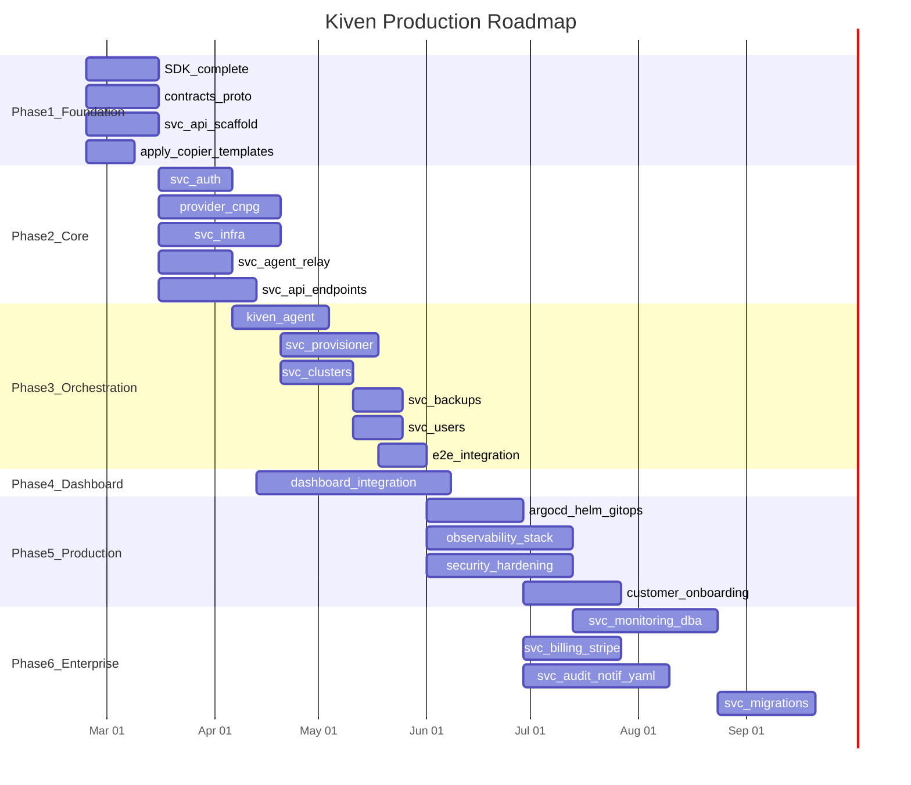

name: Kiven Team Roadmap
overview: A phased roadmap for the Kiven team to go from current state (~10% implemented) to production-ready. 6 phases covering foundation, core services, orchestration, dashboard, production infrastructure, and enterprise features.
todos:
  - id: phase1-sdk
    content: "Phase 1A: Complete kiven-go-sdk (error types, middleware, OTel instrumentation, DB helpers)"
    status: pending
  - id: phase1-proto
    content: "Phase 1A: Create contracts-proto (buf setup, agent.proto, metrics.proto)"
    status: pending
  - id: phase1-api
    content: "Phase 1B: Scaffold svc-api (chi router, DB layer, first read endpoints)"
    status: pending
  - id: phase1-templates
    content: "Phase 1C: Apply Copier templates to all Phase 2 repos + create sdk-go template"
    status: pending
  - id: phase2-auth
    content: "Phase 2A: Build svc-auth (OIDC, API keys, RBAC)"
    status: pending
  - id: phase2-cnpg
    content: "Phase 2B: Build provider-cnpg (YAML generation, status parsing)"
    status: pending
  - id: phase2-infra
    content: "Phase 2C: Build svc-infra (AWS SDK, node groups, S3, IRSA)"
    status: pending
  - id: phase2-relay
    content: "Phase 2B: Build svc-agent-relay (gRPC server, agent registration)"
    status: pending
  - id: phase2-api-endpoints
    content: "Phase 2D: Implement svc-api CRUD endpoints"
    status: pending
  - id: phase3-agent
    content: "Phase 3A: Build kiven-agent (CNPG informers, gRPC client, command executor)"
    status: pending
  - id: phase3-provisioner
    content: "Phase 3B: Build svc-provisioner (state machine, orchestrate infra + agent)"
    status: pending
  - id: phase3-services
    content: "Phase 3B: Build svc-clusters, svc-backups, svc-users"
    status: pending
  - id: phase3-e2e
    content: "Phase 3: End-to-end integration test in kind"
    status: pending
  - id: phase4-dashboard
    content: "Phase 4: Dashboard API integration, auth flow, real data"
    status: pending
  - id: phase5-deploy
    content: "Phase 5A: Production deployment (ArgoCD, Helm charts, platform-gitops)"
    status: pending
  - id: phase5-observability
    content: "Phase 5B: Observability stack (Prometheus, Loki, Tempo, Grafana, OTel)"
    status: pending
  - id: phase5-security
    content: "Phase 5C: Security hardening (Vault, mTLS, Kyverno, cert-manager)"
    status: pending
  - id: phase5-onboarding
    content: "Phase 5D: Customer onboarding (Terraform module, EKS discovery)"
    status: pending
  - id: phase6-monitoring
    content: "Phase 6A: svc-monitoring (DBA intelligence, alerts, query optimizer)"
    status: pending
  - id: phase6-billing
    content: "Phase 6B: svc-billing (Stripe, usage tracking, invoices)"
    status: pending
  - id: phase6-enterprise
    content: "Phase 6C: Enterprise features (svc-audit, svc-notification, svc-yamleditor, svc-migrations)"
    status: pending
isProject: false
---

# Kiven Team Roadmap -- From Foundation to Production

## Current State

What works today:

- **Platform tooling**: `bootstrap` (Terraform), `platform-github-management` (sync script), `reusable-workflows` (8 workflows + 5 actions), `platform-templates-service-go` (Copier template), `docs` (18 docs)
- **SDK**: `kiven-go-sdk` (15 Go files, 4 test files -- provider interface, 11 models, config, logging)
- **Dashboard**: 14 pages scaffolded, no API integration
- **Dev environment**: `kiven-dev` with Taskfile, migrations, kind/CNPG setup
- **API contract**: `svc-api` has OpenAPI spec, no Go code yet

What does NOT work: no service has Go code, no agent, no provider, no provisioning pipeline, no auth, no customer-facing functionality.

## Production Target

**Production = A customer can:**

1. Sign up and log in (OIDC + SSO/SAML)
2. Register their EKS cluster (Terraform module or CloudFormation one-click)
3. Click "Create Database" and get a PostgreSQL connection string in ~10 minutes
4. See metrics, logs, backups, users, connection info in the dashboard
5. Get DBA recommendations, alerts, and performance insights
6. Power on/off databases on schedule
7. Pay via Stripe with usage tracking
8. Have full audit trail of all operations

**6 phases**: Foundation -> Core Services -> Orchestration -> Dashboard -> Production Infrastructure -> Enterprise Features.

## Dependency Graph

```mermaid
graph TD
    subgraph phase1 [Phase 1: Foundation -- Weeks 1-3]
        SDK[kiven-go-sdk<br/>complete models]
        PROTO[contracts-proto<br/>gRPC definitions]
        API_SCAFFOLD[svc-api<br/>scaffold + DB layer]
        TEMPLATES[Apply Copier templates<br/>to all repos]
    end

    subgraph phase2 [Phase 2: Core Services -- Weeks 4-8]
        AUTH[svc-auth<br/>OIDC + API keys + RBAC]
        CNPG[provider-cnpg<br/>YAML generation]
        INFRA[svc-infra<br/>AWS SDK integration]
        API_IMPL[svc-api<br/>implement endpoints]
        RELAY[svc-agent-relay<br/>gRPC server]
    end

    subgraph phase3 [Phase 3: Orchestration -- Weeks 9-14]
        AGENT[kiven-agent<br/>CNPG watcher + gRPC client]
        PROV[svc-provisioner<br/>state machine]
        CLUSTERS[svc-clusters<br/>lifecycle management]
        BACKUPS[svc-backups<br/>backup/restore]
        USERS[svc-users<br/>PG user management]
    end

    subgraph phase4 [Phase 4: Dashboard -- Weeks 8-16]
        DASH[dashboard<br/>API integration + auth flow]
    end

    subgraph phase5 [Phase 5: Production Infra -- Weeks 15-20]
        GITOPS[platform-gitops<br/>ArgoCD + Helm]
        OBS[platform-observability<br/>Prometheus + Loki + Tempo]
        SEC[platform-security<br/>Vault + Kyverno + mTLS]
        ONBOARD[infra-customer-aws<br/>Terraform onboarding]
    end

    subgraph phase6 [Phase 6: Enterprise -- Weeks 17-24]
        MON[svc-monitoring<br/>DBA intelligence + alerts]
        BILL[svc-billing<br/>Stripe + usage tracking]
        AUDIT[svc-audit<br/>immutable audit log]
        NOTIF[svc-notification<br/>Slack + email + webhook]
        YAML[svc-yamleditor<br/>Advanced Mode]
        MIG[svc-migrations<br/>import from Aiven/RDS]
    end

    SDK --> AUTH
    SDK --> CNPG
    SDK --> INFRA
    SDK --> API_IMPL
    PROTO --> RELAY
    PROTO --> AGENT
    API_SCAFFOLD --> API_IMPL
    TEMPLATES --> AUTH
    TEMPLATES --> CNPG
    TEMPLATES --> INFRA

    AUTH --> API_IMPL
    CNPG --> AGENT
    CNPG --> CLUSTERS
    CNPG --> BACKUPS
    CNPG --> USERS
    INFRA --> PROV
    RELAY --> AGENT
    RELAY --> PROV

    API_IMPL --> DASH

    PROV --> GITOPS
    AGENT --> OBS
    CLUSTERS --> MON
    BACKUPS --> MON
    AUTH --> ONBOARD
    INFRA --> ONBOARD
    API_IMPL --> BILL
    API_IMPL --> AUDIT
    CLUSTERS --> YAML
    MON --> NOTIF
```

## Phase 1: Foundation (Weeks 1-3)

**Goal**: Every repo that Phase 2 depends on is ready: SDK complete, gRPC contracts defined, svc-api scaffolded with DB layer, Copier templates applied.

### Work Stream A: SDK + Contracts (1 developer)

| Week | Repo              | Task                                                                                                         | Deliverable                                              |
| ---- | ----------------- | ------------------------------------------------------------------------------------------------------------ | -------------------------------------------------------- |
| 1    | `kiven-go-sdk`    | Add error types package (`errors/errors.go`), HTTP client helpers, pagination types                          | Shared error handling + HTTP primitives for all services |
| 1    | `kiven-go-sdk`    | Add middleware package (logging, recovery, request ID, auth context)                                         | Reusable chi middleware for all svc-*                    |
| 1-2  | `kiven-go-sdk`    | Telemetry package gaps (traces provider, HTTP middleware, gRPC interceptors, span helpers already done): **add MeterProvider** (OTel metrics: counters, histograms, gauges), **add pgx tracing hook** (auto-trace SQL queries), **add slog bridge** (structured logs to OTel Logs), **add Kiven attribute constants** (`kiven.org_id`, `kiven.service_id` etc. as typed constants). See `docs/observability/OTEL-CONVENTIONS.md`. | Full traces + metrics + logs instrumentation from day 1 |
| 2    | `docs`            | DONE: `docs/observability/OTEL-CONVENTIONS.md` created. DONE: `OBSERVABILITY-GUIDE.md` updated to Kiven context. | OTel architecture decisions documented |
| 2    | `contracts-proto` | Define `.proto` files: `agent.proto` (Heartbeat, Status, Command streams), `metrics.proto`, `commands.proto` | gRPC contract for agent-relay communication              |
| 2    | `contracts-proto` | Set up `buf.yaml`, `buf.gen.yaml`, CI with `buf lint` + `buf breaking`                                       | Generated Go code in `gen/go/`                           |
| 3    | `kiven-go-sdk`    | Add database helpers (pgx pool factory, migration runner, transaction helpers) with OTel pgx tracing         | Every service can connect to DB with 3 lines + auto-traced queries |

### Work Stream B: svc-api Scaffold (1 developer)

| Week | Repo      | Task                                                                                                        | Deliverable                                                                  |
| ---- | --------- | ----------------------------------------------------------------------------------------------------------- | ---------------------------------------------------------------------------- |
| 1    | `svc-api` | Scaffold Go project from Copier template (`copier copy`), set up chi router, healthcheck, graceful shutdown, OTel trace provider init | Running HTTP server at :8080/healthz with OTel traces |
| 2    | `svc-api` | Database layer: pgx connection pool, migration runner on startup, repository pattern (interfaces)           | `ServiceRepository`, `OrganizationRepository`, `BackupRepository` interfaces |
| 2    | `svc-api` | OpenAPI validation middleware (validate requests/responses against spec)                                    | Every request validated against openapi.yaml                                 |
| 3    | `svc-api` | Implement read-only endpoints: `GET /v1/plans`, `GET /v1/services`, `GET /v1/services/{id}`                 | First working API endpoints returning data from DB                           |

### Work Stream C: Apply Templates (1 developer, part-time)

| Week | Repo                        | Task                                                                                                                                                                               | Deliverable                                                                                   |
| ---- | --------------------------- | ---------------------------------------------------------------------------------------------------------------------------------------------------------------------------------- | --------------------------------------------------------------------------------------------- |
| 1-2  | All Phase 2 repos           | Run `copier copy` from `platform-templates-service-go` for: `svc-auth`, `svc-infra`, `svc-agent-relay`, `svc-clusters`, `svc-backups`, `svc-users`, `provider-cnpg`, `kiven-agent` | All repos have: editorconfig, golangci, pre-commit, CI workflow, Taskfile, Dockerfile, go.mod, OTel init |
| 2-3  | `platform-templates-sdk-go` | Create Copier template for sdk-go (same as service-go but no Dockerfile, no cmd/, no gRPC)                                                                                         | Template ready for provider repos and CLI                                                     |
| 3    | `kiven-dev`                 | Verify `task dev` works end-to-end: Docker Compose + kind + CNPG + all services can start                                                                                          | Working local dev environment                                                                 |

**Phase 1 exit criteria**: `task dev` starts infra, `svc-api` returns service plans from DB, `contracts-proto` generates Go code, all Phase 2 repos are scaffolded.

---

## Phase 2: Core Services (Weeks 4-8)

**Goal**: Authentication works, CNPG YAML can be generated, AWS resources can be created, agent can connect to relay. These are the building blocks the provisioner needs.

### Work Stream A: Auth (1 developer)

| Week | Repo       | Task                                                                            | Deliverable                                |
| ---- | ---------- | ------------------------------------------------------------------------------- | ------------------------------------------ |
| 4    | `svc-auth` | OIDC integration (Google/GitHub login via `coreos/go-oidc`), JWT token issuance | Users can log in, get a JWT                |
| 5    | `svc-auth` | API key management (create, list, revoke, hash with argon2)                     | Programmatic access for CLI/Terraform      |
| 6    | `svc-auth` | RBAC middleware (admin, operator, viewer roles), org/team model                 | Role-based access control on all endpoints |
| 6    | `svc-api`  | Integrate auth middleware from `svc-auth`, protect all endpoints                | Every API call requires valid token        |

### Work Stream B: Provider + Agent Foundation (1 developer)

| Week | Repo              | Task                                                                                                                    | Deliverable                                         |
| ---- | ----------------- | ----------------------------------------------------------------------------------------------------------------------- | --------------------------------------------------- |
| 4-5  | `provider-cnpg`   | Implement Provider interface for CNPG: `GenerateClusterYAML()`, `GeneratePoolerYAML()`, `GenerateScheduledBackupYAML()` | Given a service definition, produce valid CNPG YAML |
| 5-6  | `provider-cnpg`   | Implement `ParseStatus()`, `ParseMetrics()` from CNPG CRD status fields                                                 | Can read CNPG cluster state                         |
| 6    | `contracts-proto` | Finalize agent protocol: Heartbeat (bidirectional), CommandStream (server-push), MetricsStream (agent-push)             | Stable gRPC contract                                |
| 7-8  | `svc-agent-relay` | gRPC server: agent registration, heartbeat tracking, command dispatch queue                                             | Agents can connect and receive commands             |

### Work Stream C: Infrastructure (1 developer)

| Week | Repo        | Task                                                                                  | Deliverable                                   |
| ---- | ----------- | ------------------------------------------------------------------------------------- | --------------------------------------------- |
| 4-5  | `svc-infra` | AWS SDK integration: `AssumeRole` into customer account, EKS `DescribeCluster`        | Can access customer AWS resources             |
| 5-6  | `svc-infra` | Create EKS managed node group (dedicated for databases, tainted, right instance type) | Can create database nodes in customer cluster |
| 6-7  | `svc-infra` | Create S3 bucket (encrypted, lifecycle rules) for backups, create IRSA role for CNPG  | Backup infrastructure ready                   |
| 7-8  | `svc-infra` | Create EBS StorageClass (gp3, encrypted, right IOPS)                                  | Storage ready for database volumes            |

### Work Stream D: svc-api Endpoints (shared across team)

| Week | Repo      | Task                                                                                       | Deliverable                               |
| ---- | --------- | ------------------------------------------------------------------------------------------ | ----------------------------------------- |
| 5-6  | `svc-api` | CRUD endpoints: `POST /v1/services`, `DELETE /v1/services/{id}`, `PATCH /v1/services/{id}` | Can create/update/delete services via API |
| 7-8  | `svc-api` | Customer cluster endpoints: `POST /v1/clusters` (register EKS), `GET /v1/clusters`         | Can register customer EKS clusters        |
| 8    | `svc-api` | Backup endpoints, user management endpoints                                                | Full CRUD for all resources               |

**Phase 2 exit criteria**: User can log in via OIDC, create a service via API (stored in DB), `provider-cnpg` generates valid CNPG YAML, `svc-infra` can create node groups in test AWS account, agent can connect to relay.

---

## Phase 3: Orchestration (Weeks 9-14)

**Goal**: The provisioning pipeline works end-to-end. Customer clicks "Create Database" and gets a running PostgreSQL.

### Work Stream A: Agent (1 developer)

| Week  | Repo               | Task                                                                                   | Deliverable                                   |
| ----- | ------------------ | -------------------------------------------------------------------------------------- | --------------------------------------------- |
| 9-10  | `kiven-agent`      | Go binary: gRPC client to relay, CNPG informers (watch Cluster/Backup CRDs), heartbeat | Agent running in kind, reporting CNPG status  |
| 10-11 | `kiven-agent`      | Command executor: receive YAML from relay, `kubectl apply`, report result              | Can apply CNPG manifests on command           |
| 11-12 | `kiven-agent`      | PG stats collector: connect to PostgreSQL, collect pg_stat_statements, send to relay   | Metrics flowing to SaaS                       |
| 12    | `kiven-agent-helm` | Helm chart for agent deployment                                                        | One-command agent install in customer cluster |

### Work Stream B: Provisioner + Services (2 developers)

| Week  | Repo              | Task                                                                                                                           | Deliverable                                        |
| ----- | ----------------- | ------------------------------------------------------------------------------------------------------------------------------ | -------------------------------------------------- |
| 9-10  | `svc-provisioner` | State machine: `provisioning_jobs` table, steps: create_nodes -> create_storage -> create_s3 -> install_cnpg -> deploy_cluster | Provisioning pipeline orchestration                |
| 10-11 | `svc-provisioner` | Integration with `svc-infra` (create AWS resources) + `svc-agent-relay` (send commands to agent)                               | Full pipeline: API -> provisioner -> infra + agent |
| 11-12 | `svc-clusters`    | Cluster lifecycle: get status from agent, scale (change instances), power on/off                                               | Can see cluster status, scale up/down              |
| 12-13 | `svc-backups`     | Backup management: trigger backup via agent, list backups from S3, PITR restore                                                | Backup/restore working                             |
| 13-14 | `svc-users`       | PG user management: create user via agent (SQL execution), list users, reset password                                          | Can manage database users                          |

### Integration Testing (all developers)

| Week  | Task                                                                                                                                  | Deliverable                    |
| ----- | ------------------------------------------------------------------------------------------------------------------------------------- | ------------------------------ |
| 13-14 | End-to-end test in kind: create service -> provisioner runs -> agent deploys CNPG -> PostgreSQL running -> connection string returned | MVP proof: the full loop works |

**Phase 3 exit criteria**: In the local dev environment (kind), a user can create a service via API, the provisioner creates a CNPG cluster via the agent, and the user gets a working PostgreSQL connection string.

---

## Phase 4: Dashboard Integration (Weeks 8-16, parallel with Phase 3)

**Goal**: The dashboard is connected to the API and a customer can do everything via the UI.

### Work Stream (1 frontend developer)

| Week  | Repo        | Task                                                                               | Deliverable                       |
| ----- | ----------- | ---------------------------------------------------------------------------------- | --------------------------------- |
| 8-9   | `dashboard` | API client layer: fetch wrapper, auth token management, error handling             | Type-safe API client              |
| 9-10  | `dashboard` | Auth flow: login page, OIDC redirect, token storage, protected routes              | Users can log in                  |
| 10-11 | `dashboard` | Service list page: real data from API, create service wizard connected to API      | Can create a database from the UI |
| 11-12 | `dashboard` | Service detail page: real connection info, status from API, power on/off           | Can see database status           |
| 12-14 | `dashboard` | Backups page (real data), Users page (CRUD), Metrics page (charts from agent data) | Full dashboard functionality      |
| 14-16 | `dashboard` | Polish: loading states, error handling, responsive design, dark mode               | Production-ready UI               |

**Phase 4 exit criteria**: Customer can log in, create a database, see status, manage users/backups -- all from the dashboard.

---

## Phase 5: Production Infrastructure (Weeks 15-20, overlaps with Phase 4)

**Goal**: Everything needed to run Kiven in production on real AWS infrastructure. Services deploy via GitOps, observability is in place, security is hardened, customers can onboard autonomously.

### Work Stream A: Deployment + GitOps (1 developer)

| Week  | Repo               | Task                                                                             | Deliverable                                      |
| ----- | ------------------ | -------------------------------------------------------------------------------- | ------------------------------------------------ |
| 15    | `platform-gitops`  | ArgoCD ApplicationSets for all svc-* services, environments (dev, staging, prod) | GitOps deployment pipeline                       |
| 15-16 | All svc-* repos    | Production Helm charts (per service), Kustomize overlays for env-specific config | `helm install svc-api` works                     |
| 16-17 | `kiven-dev`        | Staging environment in real EKS (not kind): Terraform for Kiven SaaS EKS cluster | Staging cluster running on AWS                   |
| 17-18 | `platform-gitops`  | Promotion workflow: dev -> staging -> prod with approval gates                   | Controlled rollouts                              |
| 18    | `platform-gateway` | Cloudflare Terraform: DNS, WAF rules, DDoS protection, Tunnel to EKS             | kiven.io resolves, API accessible via Cloudflare |

### Work Stream B: Observability (1 developer)

| Week  | Repo                     | Task                                                                              | Deliverable                        |
| ----- | ------------------------ | --------------------------------------------------------------------------------- | ---------------------------------- |
| 15-16 | `platform-observability` | Install Prometheus + Grafana via Helm, ServiceMonitor for all svc-* services      | Metrics collection and dashboards  |
| 16-17 | `platform-observability` | Install Loki + Promtail, configure log ingestion from all pods                    | Centralized logging                |
| 17    | `platform-observability` | OTel Collector two-tier: DaemonSet agents (forward) + Gateway Deployment (batch, filter, export). Exporter helper with persistent queue (file-backed, survives restarts). Tempo as trace backend. | Distributed tracing with resilient pipeline |
| 17-18 | `platform-observability` | Grafana dashboards: service health, request latency, error rates, agent status    | Operations visibility              |
| 18-19 | `platform-observability` | SLO definitions (99.9% API availability, <200ms p95 latency), error budget alerts | SLO monitoring with Sloth or Pyrra |
| 19-20 | `platform-observability` | On-call runbooks: automated alert -> runbook link, PagerDuty integration          | Operational readiness              |

### Work Stream C: Security Hardening (1 developer)

| Week  | Repo                  | Task                                                                                    | Deliverable                             |
| ----- | --------------------- | --------------------------------------------------------------------------------------- | --------------------------------------- |
| 15-16 | `platform-security`   | HashiCorp Vault: install, configure dynamic secrets for PostgreSQL and AWS credentials  | No more static secrets                  |
| 16-17 | `platform-security`   | External Secrets Operator: sync Vault secrets to Kubernetes Secrets for all services    | Services read secrets from K8s natively |
| 17    | `platform-security`   | cert-manager: install, configure Let's Encrypt ClusterIssuer, auto-TLS for all services | HTTPS everywhere                        |
| 17-18 | `platform-security`   | Kyverno policies: require resource limits, require labels, block privileged pods        | Policy enforcement                      |
| 18-19 | `platform-networking` | Cilium network policies: restrict pod-to-pod traffic, mTLS between services             | Zero-trust networking                   |
| 19-20 | `platform-security`   | Image signing (Cosign), SBOM generation, vulnerability scanning in CI                   | Supply chain security                   |

### Work Stream D: Customer Onboarding (shared)

| Week  | Repo                    | Task                                                                                     | Deliverable                       |
| ----- | ----------------------- | ---------------------------------------------------------------------------------------- | --------------------------------- |
| 16-17 | `infra-customer-aws`    | Terraform module (primary): creates `KivenAccessRole` in customer AWS account (IAM + trust policy). Published to Terraform Registry. | IaC-native onboarding |
| 17    | `infra-customer-aws`    | CloudFormation template (alternative): same IAM Role, launchable via one-click URL for non-Terraform customers | Quick-start onboarding for all    |
| 17-18 | `infra-customer-aws`    | EKS discovery: validate cluster access, discover node capacity, storage classes, CNPG    | Automated cluster validation      |
| 18-19 | `svc-api` + `dashboard` | Onboarding wizard: choose Terraform or CloudFormation -> paste IAM Role ARN -> validate -> register cluster -> create first DB | Self-service customer onboarding  |
| 19-20 | `infra-customer-aws`    | Advanced Terraform modules: VPC peering, private endpoints, custom KMS                   | Enterprise networking options     |

**Phase 5 exit criteria**: Services deploy via ArgoCD to staging EKS, Grafana shows metrics/logs/traces, Vault manages secrets, customers can onboard via Terraform module OR CloudFormation + dashboard wizard, Cloudflare serves kiven.io.

---

## Phase 6: Enterprise Features (Weeks 17-24, overlaps with Phase 5)

**Goal**: Revenue-generating features, compliance, DBA intelligence, operational maturity.

### Work Stream A: Monitoring + DBA Intelligence (1 developer)

| Week  | Repo             | Task                                                                                       | Deliverable                             |
| ----- | ---------------- | ------------------------------------------------------------------------------------------ | --------------------------------------- |
| 17-18 | `svc-monitoring` | Metrics ingestion from agent: store pg_stat_statements, connection counts, replication lag | Metrics pipeline from agent to SaaS     |
| 18-19 | `svc-monitoring` | DBA recommendations engine: auto-tune postgresql.conf based on workload patterns           | "Increase shared_buffers to 4GB" alerts |
| 19-20 | `svc-monitoring` | Query optimizer: slow query detection, visual EXPLAIN, index suggestions                   | Actionable query performance insights   |
| 20-21 | `svc-monitoring` | Capacity planner: storage/CPU growth forecasting, "disk full in 14 days" warnings          | Proactive capacity alerts               |
| 21-22 | `svc-monitoring` | Backup verification: automated weekly restore tests, RPO compliance dashboard              | Verified backup reliability             |

### Work Stream B: Billing (1 developer)

| Week  | Repo          | Task                                                                            | Deliverable                      |
| ----- | ------------- | ------------------------------------------------------------------------------- | -------------------------------- |
| 18-19 | `svc-billing` | Stripe integration: customer/subscription lifecycle, payment methods            | Customers can subscribe to plans |
| 19-20 | `svc-billing` | Usage tracking: compute hours per cluster, storage consumption, backup storage  | Accurate usage metering          |
| 20-21 | `svc-billing` | Invoice generation: monthly invoices with line items (Kiven fee + AWS estimate) | Professional invoices            |
| 21-22 | `svc-billing` | Dashboard billing page: plan upgrade/downgrade, payment history, cost breakdown | Self-service billing             |

### Work Stream C: Enterprise Services (1-2 developers)

| Week  | Repo               | Task                                                                                                | Deliverable                        |
| ----- | ------------------ | --------------------------------------------------------------------------------------------------- | ---------------------------------- |
| 17-18 | `svc-audit`        | Immutable audit log: every API call, every infra change, who/what/when, stored in append-only table | Compliance-ready audit trail       |
| 18-19 | `svc-notification` | Alert dispatch: Slack, email, webhook, PagerDuty integration                                        | Multi-channel alerting             |
| 19-20 | `svc-yamleditor`   | Advanced Mode: YAML viewer/editor with Monaco, CNPG schema validation, diff before apply            | Expert users can see/edit all YAML |
| 20-21 | `svc-yamleditor`   | Change history: git-like timeline of all YAML changes, rollback to any version                      | Full configuration history         |
| 21-22 | `svc-migrations`   | Import from Aiven: logical replication setup, progress tracking, cutover                            | Customers can migrate from Aiven   |
| 22-24 | `svc-migrations`   | Import from RDS + bare PostgreSQL: pg_dump/restore, pg_basebackup                                   | Customers can migrate from any PG  |
| 22-24 | `svc-auth`         | SSO/SAML support (enterprise customers), advanced RBAC (per-service permissions)                    | Enterprise auth requirements       |

**Phase 6 exit criteria**: Billing works (Stripe), audit log records everything, alerts dispatch to Slack/email, DBA intelligence gives recommendations, Advanced Mode lets experts edit YAML, customers can migrate from Aiven/RDS.

---

## Team Allocation (assuming 4 developers)

### Developer Assignment Suggestion

- **Dev 1 (Backend Lead)**: SDK -> svc-auth -> svc-provisioner -> svc-monitoring -> svc-billing
- **Dev 2 (K8s/Infra)**: contracts-proto -> provider-cnpg -> kiven-agent -> platform-observability -> platform-security
- **Dev 3 (Cloud/AWS)**: svc-api scaffold -> svc-infra -> svc-clusters + svc-backups + svc-users -> platform-gitops -> infra-customer-aws
- **Dev 4 (Frontend)**: Apply templates -> dashboard -> svc-yamleditor -> svc-audit + svc-notification + svc-migrations

---

## Milestones

| Week | Milestone                 | How to Verify                                                               |
| ---- | ------------------------- | --------------------------------------------------------------------------- |
| 3    | Foundation done           | `svc-api` returns plans from DB, `buf generate` works, all repos scaffolded |
| 5    | Auth works                | Log in via GitHub OIDC, get JWT, access protected endpoint                  |
| 6    | CNPG YAML generates       | `provider-cnpg` produces valid Cluster YAML from service definition         |
| 8    | AWS resources work        | `svc-infra` creates node group + S3 bucket in test-client AWS account       |
| 10   | Agent connects            | Agent in kind sends heartbeat to relay, receives commands                   |
| 12   | Provisioning works        | Create service -> provisioner -> agent deploys CNPG -> PG running           |
| 14   | E2E in kind               | Full loop works locally: login -> create DB -> get connection string        |
| 16   | Dashboard complete        | Everything works from the UI                                                |
| 17   | Staging on AWS            | Services running in real EKS via ArgoCD                                     |
| 19   | Observability live        | Grafana dashboards with metrics, logs, traces from staging                  |
| 20   | Security hardened         | Vault secrets, mTLS, Kyverno policies, cert-manager TLS                     |
| 20   | Customer onboarding works | Terraform module OR CloudFormation -> EKS discovery -> create first DB     |
| 22   | Billing live              | Customer subscribes, gets invoiced via Stripe                               |
| 22   | DBA intelligence          | Recommendations, slow query detection, backup verification                  |
| 24   | Production ready          | All enterprise features, migrations, SSO/SAML, audit log                    |

## Production Readiness Checklist (before first customer)

- All services deploy via ArgoCD (no manual `kubectl apply`)
- Grafana dashboards for every service (RED metrics: Rate, Errors, Duration)
- SLOs defined and monitored (99.9% API, 99.99% database uptime)
- On-call rotation set up with PagerDuty/OpsGenie
- Runbooks for top 10 alert scenarios
- DR tested: failover to second AZ, restore from backup
- Security audit: Vault secrets, mTLS, Kyverno, no static credentials
- Chaos testing: node failure, agent disconnect, CNPG failover
- Backup verification: automated weekly restore test passes
- Customer onboarding flow tested end-to-end with test-client AWS account
- Billing tested: subscription -> usage -> invoice -> payment
- Documentation complete: API docs (Redoc), user guides, admin guides
- Legal: Terms of Service, Privacy Policy, DPA (Data Processing Agreement)
- SOC2 Type 1 evidence collection started
